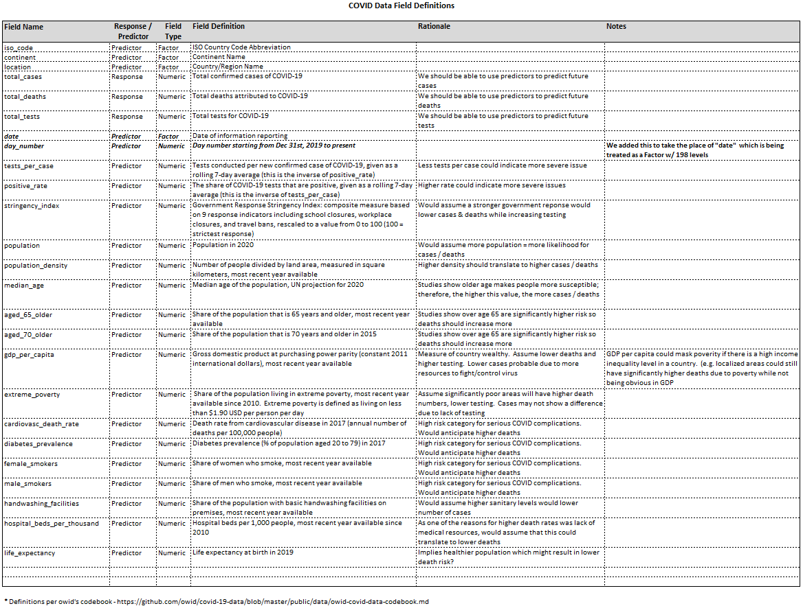

---
#Typical header for prior assignments, though added a global
#    Height / Width setting for graphs since there will be numerous throughout
#    project.
# NOTES: 
#   - Per Final Assignment, author names not shown on title; therefore author field below is blank.
title: '<CENTER><H1>Yet Another COVID Analysis (YACA)</H1>><h3>STAT420 Summer 2020 - Final Project</h3></CENTER>'
author: "" 
date: '<CENTER>8/6/2020</CENTER>'
output:
  html_document: 
    theme: readable
    toc: yes 
    toc_depth: 2
    fig_height: 6
    fig_width : 20 
  pdf_document: default
urlcolor: cyan
---

<style type="text/css">
.main-container {
  max-width: 1800px;
  margin-left: auto;
  margin-right: auto;
}
</style>


```{r setup, echo = FALSE, message = FALSE, warning = FALSE}

#This variable will be used to control the echo / message / warning settings for r chunks that we do not 
#   want active during knitting.  During development / testing, set this to TRUE.  Set to FALSE 
#   when done testing code, etc.
boolDebug = FALSE 

#These variabbles will be used to minimize the number of simulations run during document format testing
#   in knitr.  For example Study 1 asks for 2,000 sims x 3 sigmas x 2 models = 12,000 times
#   this override would limit that to a fraction useful when doing repetitive knitr runs to validate formatting
#     where the exact data is that important...
boolKnitrSimsOverride = FALSE
intKnitrSimsOverrideNum = 10

#Override for generating model vs. loading stored copy
boolLoadStoredModel = TRUE 

#Set default options 
# width = 80 
options(scipen = 1, digits = 4, width = 80, fig_height = 8, fig_width = 30 
)


```


```{r supportFunctions, include = boolDebug, message = boolDebug, warning = boolDebug}

#----------------------------------------
# This section contains "library" functions for code that we will re-use throughout the project 
#----------------------------------------

rmse = function(y, y_hat){
  sqrt(sum((y-y_hat)^2)/length(y) )
}


diagnostics = function(model, pcol='grey', lcol='dodgerblue', alpha=0.05, plotit = TRUE, testit = TRUE)
{
  #Input Parameter Definitions
    # model`, an object of class `lm()`, that is a model fit via `lm()`
    #`pcol`, for controlling point colors in plots, with a default value of `grey`
    #`lcol`, for controlling line colors in plots, with a default value of `dodgerblue`
    #`alpha`, the significance level of any test that will be performed inside the function, with a default value of `0.05`
    #`plotit`, a logical value for controlling display of plots with default value `TRUE`
    #`testit`, a logical value for controlling outputting the results of tests with default value `TRUE`
 #Output Parameter Definitions
   #  If testit == TRUE
     #  p_val`, the p-value for the Shapiro-Wilk test for assessing normality
     # `decision`, the decision made when performing the Shapiro-Wilk test using the `alpha` value input to the function.
     #            "Reject" if the null hypothesis is rejected, otherwise "Fail to Reject."
   #  if plotit == TRUE
     #     A  fitted versus residuals plot that
     #        - adds a horizontal line at $y = 0$
     #        - labels the $x$-axis "Fitted"
     #        - labels the $y$-axis "Residuals."
     #        - The points and line should be colored according to the input arguments.
     #        - Gives the plot a title.
     #    A Normal Q-Q plot of the residuals that
     #        - adds the appropriate line using `qqline()`.
     #        - The points and line should be colored according to the input arguments.
     #        - Be sure the plot has a title.
  # Assumptions
  # - Assume all passed parameters are valid, we are not error checking / validating parameters (e.g. that model is in fact a valid linear model)
  # - Assume that both testit and plotit can be run in the same call.  (e.g. testit==TRUE and plotit ==TRUE )
  # Initialize variables
  # Debug variable for function testing
  boolDebug = FALSE
  return_val = list()
  #Check for testit
  if (testit == TRUE)
  {
     #Execute the Shapiro test against the residuals of the model and then get the
     stest = shapiro.test(resid(model))
     #Debug output
     if (boolDebug)
     {
        #Confirm output of shapiro
        stest
        names(stest)
        str(stest)
     }
    #Get the pvalue
    p_value = stest$p.value
    #Perform a test against alpha and store result in return variable
    decision = ifelse(p_value < alpha, "Reject", "Fail to Reject")
    #Create the named return list
    return_val = list(p_val = p_value, decision = decision)
  }
  #Check for plotit
  if (plotit == TRUE)
  {
    # Configure plotting for one row with 2 columns (e.g. side by side plots)
    par(mfrow = c(1, 2))
    # Create a plot with fitted values on Y axis, Residuals on the X axis, using provided colors, etc.
    plot(fitted(model), resid(model),
         col = pcol,
         xlab = "Fitted", ylab = "Residuals",
         main = "Fitted vs Residuals")
    #Create the horizontal line at zero using the color passed into the function
    abline(h = 0, col = lcol)
    #Display the grid
    grid()
    # Create the normalized qq plot using qqnorm, using parameter for color
    qqnorm(resid(model), col = pcol, pch = 20)
    # Add the line using qqline and set color to parameter value
    qqline(resid(model), col = lcol)
    #Display Grid
    grid()
  }
  #Provide return value if needed
  if (testit == TRUE) { return_val }
}


#Expanded functionality to validate Package Installation State
#ccbeyer2 


#------------------------------------------------------------------------------
# isInstalled - Checks to determine if the specified R Package has 
#               been installed.  
#
# Inputs:
#           packageName - Single string value of a package
#
# Output: 
#           Boolean - TRUE = Package present / FALSE = Package not present
#
# Notes :   Could add more logic, but this is good enough for intended purpose
#----------------------------------------------------------------------------- 

isInstalled = function(packageName)
{
    #Get a list of installed packages on your machine 
    dfPackages = as.data.frame(installed.packages()[,c(1,3)])

    #Check if the Package passed to function exists in the list of installed packages
    ifelse(any(dfPackages$Package == packageName), TRUE, FALSE)
}


#------------------------------------------------------------------------------
# getPackageVersion  - Checked Installed.Packages for specified package name
#                      and returns version 
#
# Inputs:
#           packageName - Single string value of a package
#
# Output: 
#           String - Version Number / (or NULL if not found)
#
# Notes :   Could add more logic, but this is good enough for intended purpose
#----------------------------------------------------------------------------- 

getPackageVersion = function(packageName)
{
    #Get a list of installed packages on your machine 
    dfPackages = as.data.frame(installed.packages()[,c(1,3)])

    #Check if the Package passed to function exists in the list of installed packages
    if (any(dfPackages$Package == packageName))
    {
        #print ("found version")
        #Module Found, get verison and return 
        return (dfPackages[dfPackages$Package==packageName, c("Version")])
    }
}


#------------------------------------------------------------------------------


#------------------------------------------------------------------------------
# validatePackages  -  Processes a list of packages and determines if they are
#                      Installed or not.  Attempts to install missing packages
#
# Inputs:
#           packageNames - Single string / list of package names
#
# Output: 
#           STDOUT - Output displayed to screen indicating success/failure
#
# Notes :   Should make this a return value, but .... future TO DO
#----------------------------------------------------------------------------- 

validatePackages = function(packageNames)
{
  
  #Print Header
  print ("-------------------- Required Package Validation  Check ---------------------------")
  
  #Iterate through requried packages and verify if they are installed
  for(i in 1:length(packageNames))
  {
      #Simplify comparisons below
      if(isInstalled(packageNames[i]))
      {
          #Package Exists 
          #Silly way to print a string, but thanks R 
          print(sprintf("   Package [%s] is already installed, currevent version is [%s]",packageNames[i],getPackageVersion(packageNames[i])))
          
      }
      else
      {
          #Package Does Not Exist, install it
          #   NOTE - There are a lot of potential installation configuration options.....
          #          This is just a simply PoC
  
          #Silly way to print a string, but thanks R 
          print(sprintf("   Package [%s] is not installed, attempting to install",packageNames[i]))
  
          #Trigger basic installation
          install.packages(packageNames[i])
  
          #Do another check to see if this has been installed.
          if(isInstalled(packageNames[i]))        
          {
                #Installed successfully since it is now in installed.packages list. 
                print(sprintf("        [%s] is now installed, version is
                              [%s]",packageNames[i],getPackageVersion(packageNames[i])))
            
          }
          else
          {
                #Something went wrong as it is still not in the list, so give a warning
                print(sprintf("        [WARNING!!!] [%s] failed to install.  Please see output above this message for more information!  Your project may not work properly without this package!",packageNames[i]))
            
          }  
        
      }
  } 
}
  


```


***

```{r loadPackages, echo = boolDebug, message = boolDebug, warning = boolDebug, include = boolDebug}

print('')
print ('------- Part (0) Package Load & Default Settings  -----------------')
print('')


#Create a list of required packages for this assignment
lstReqPackages = c("readr", "knitr", "broom", "tidyr", "ggplot2", "kableExtra", "tidyverse","caret", "reshape")

#Validate Packages
validatePackages(lstReqPackages)

#Activate Packages 
for(pckg in lstReqPackages){ library(pckg,character.only = TRUE)}

#additional default options for knitr 
opts_chunk$set(cache = FALSE, autodep = TRUE)


```


-------------------------------

# Introduction

-------------------------------


While there is a plethora of information about COVID-19 online, it is hard to know how accurate the information presented to us is, from various sources.  By analyzing the data ourselves, we can become better informed about the current pandemic and test our skills on real-world, current data.  We hope to learn insight about how different countries’ circumstances and responses to the outbreak affected their outcomes, with minimal bias.  Ultimately our goal is to use this data, and our understanding of it, to create a predictive model allowing us to estimate future death rates.

The data that we will be using for this project is provided by <i>Our World In Data</i>.  They are a collaboration between researchers at the Unviersity of Oxford and the non-profit organization Global Change Data Lab.  Our World in Data focuses on the large problems that will continue to confront humans for centuries and the long-lasting, forceful changes that gradually reshape our world.  Given the global, and potentially long lasting, impact of COVID-19, they have created multiple datasets help people analyze it.  We will be using their <b>Coronavirus Source Data</b> datset.  This dataset is updated daily and contains many relevant variables related to COVID-19 infections, deaths and tests grouped by Country and Continent.  A more detailed explanation of the data can be found in Appexndix sections A & B at the end of this report.  

You can also visit the Our World in Data website for additional information: https://ourworldindata.org/coronavirus-source-data


-------------------------------

# Methods


As we are focusing on creating a predictive model, our primary goal is to find the model with the lowest possible error rate while not overfitting.  To that end, we will be generating a series of models and employing multiple strategies to compare / contrast them to determine which model will best predict.  Some of the strategies that we will employ are:

- Data Preparation (e.g. removal of unneded variables / missing data / etc.)
- TRAIN / TEST Data Set split (80% to 20%)
- Model comparison via ANOVA
- RMSE comparisons
- Graphical Analysis (e.g. BoxPlot / Q-Q Plot / Fitted vs Residuals / etc. )  [<B>NOTE: </B> Graph output will be presented in the Results section]
- Outlier Identification & Removal via Cook's Distance 

For a detailed description of the data, including definitiosn for the relevant variables, please see the Appendix.  A table has been provided which identifies each variable, its exact definition, which oens will be used, and their expected "value" to our analysis.  

In regards to our decision making process, we reviewed the available data variables and inferred which may be good predictors for our response (deaths).  We used that as a model and calculated the RMSE.  We also began generating other models, such as an additive main effects.  We also looked at 2nd / 3rd / 4th orders and performed some transformations, such as LOG on the response.  For each model we looked at ANOVA comparison results and calculated the RMSE values.  (a full table will be provided in the Results section).  After we felt we reached an optimal RMSE / ANOVA significance result, we stopped analyzing additional models.

Please note that some of the code below has been refactored to make it easier to view the models that were reviewed.  We followed an iterative approach while initially working through the models which may not be apparent in the code block below as we have grouped the model creation and analysis sections to make it easier to read, etc. 


```{r Methods_DataPreparation, results="hold"}

#Import the data set from the same folder as the report and default strings to Factors 
covid_orig = read.csv("owid-covid-data.csv", stringsAsFactors = TRUE)

#Generate the Missing Value Statistics (Referenced in Appendix)
nacounts = c(sapply(covid_orig, function(x) sum(is.na(x)/length(x))))*100

#Create a subset of the original data which contains the variables of interest 
covid = covid_orig %>% select("total_deaths","continent" ,   "day_number", "total_cases" , "new_cases" ,"stringency_index" ,    "aged_65_older"  , "population" ,  "population_density", "gdp_per_capita", "extreme_poverty")

#Further reduce the dataset by eliminating the empty "na" values
covid_clean = na.omit(covid)


#Create TRAIN / TEST Split on data (80% Train, 20% Test)

#Establish a consistent seed (necesasry for collaboration & validation activities) 
set.seed(1234)

#Create the list of TRAIN data rows 
trn_idx = sample(1:nrow(covid_clean), floor(nrow(covid_clean) * 0.8))

#Create the list of TEST data rows 
test_idx = setdiff(1:nrow(covid_clean),trn_idx)

#Create the datasets based off of the row IDs returned above
covid_trn = covid_clean[trn_idx,]
covid_tst = covid_clean[test_idx,] 


#--------------------- Provide Output for DAta Preparation ----------------------------------------
print('')
print ('------- Methods - Part 1 -  Data Preparation   -----------------')
print('')

cat("     Original Observations      = [", nrow(covid_orig), "] and [", length(covid_orig), "] variables", "\n")
cat("     'Cleaned' Observations     = [", nrow(covid_clean), "] and [", length(covid_clean), "] variables", "\n")
cat("     TRAINING Observations      = [", nrow(covid_trn), "] and [", length(covid_trn), "] variables", "\n")
cat("     TEST Observations          = [", nrow(covid_tst), "] and [", length(covid_tst), "] variables", "\n")

```


```{r Methods_ModelCreation, warning = FALSE, error=FALSE, result="hold"}

#-----------------------------------------------------------------------------------------------------------------------------------------------------
#--NOTE : Portions of this code have been refactored to make it easier to read; however, the original exploration was performed in a more of an iterative
#         process.  For instance, a model was defined, them it was anova / RMSE tested against previous model, etc.  Here we are defining all of the models up 
#--       front to make it easier to view from a grading perspective, etc.  
#-----------------------------------------------------------------------------------------------------------------------------------------------------

#----------------------- Define Models Perform Basic Model Analysis: null model, additive model, and 2 way interactions

# Create Model List
models = vector(21, mode="list")

# Define the Additive "Main Effect" Model
mdl_add = lm(total_deaths ~ ., data = covid_trn)

#Create a Second Order Interaction Model w/ Log Transformation on Response 
mdl_int2_log = lm(log(total_deaths + 1) ~ (.)^2, data = covid_trn)

#Create a Third ORder Interaction Model
mdl_int3 = lm(total_deaths ~ (.)^3, data = covid_trn)

#Attempt to Remove Outliers via Cook's Distance 
cd_mdl3 = lm(total_deaths ~ (.)^3, data = covid_trn, 
             subset = cooks.distance(mdl_int3) <= 4 / length(cooks.distance(mdl_int3)))

#Stepwise Models 
# NOTE - For internal development we saved the results to .RDS and reload those instead of recalculating 

# As these are very "expensive" computations, if the flag is set, we will restore this from 
#    previously saved values
 
 if (boolLoadStoredModel) 
 {
    #Load the cached RDS Data 
    mdl_back = readRDS("./backward_selection_mdl.rds")

 } else {
    #Create Models computationally  

    #Backwards Model for 3rd Order Inteactions after Cook's Distance Outliers removed 
    mdl_back = step(cd_mdl3, direction = 'backward', trace = 0)

 }


# As these are very "expensive" computations, if the flag is set, we will restore this from 
#    previously saved values
 
 if (boolLoadStoredModel) 
 {
      #Load the cached RDS data for these models
      mdl_back_full = readRDS("./backward_selection_mdl_full.rds")

 } else {
    #Create Models computationally  

    mdl_back_full = step(mdl_int3, direction = 'backward', trace = 0)
  

 }   


  #Create Models via generalized model by using cross validation 
  #    Create 3rd Order interactive model 
  set.seed(1234)
  train_control = trainControl(method="cv", number=10)
  
  #cv_mdl1 = train(total_deaths ~ .^3, data=covid_trn, method="glm", trControl=train_control)
  cv_mdl_int3 = train(total_deaths ~ .^3, data=covid_trn, method="glm", trControl=train_control)
  

 #4th Order Interaction Cross Validation Model   
 if (boolLoadStoredModel) 
 {
   #Read the 5 way trained model 
   cv_mdl4 = readRDS("./4_way_CV_mdl.rds")
 } else {
    #Create Models computationally  
    cv_mdl4 = train(total_deaths ~ .^4, data=covid_trn, method="glm", trControl=train_control)
 }
        

#5th Order Interaction Cross Validation Model     
 if (boolLoadStoredModel) 
 {

   #Read the 5 way trained model 
   cv_mdl5 = readRDS("./5_way_CV_mdl.rds")
   
 } else {
    #Create Models computationally  
    cv_mdl5 = train(total_deaths ~ .^5, data=covid_trn, method="glm", trControl=train_control)    
 }


```  


```{r Methods_ModelAnalysis, warning = FALSE, error=FALSE, include = boolDebug}

#Create list of Models
model_names = c( 'Additive Main Effects', 
                 'LOG 2nd Order Interactions', 
                 '3rd Order Interactions',
                 'Cooks Distance 3rd Order Interactions',
                 'Cooks Distance 3rd Order Step',
                 '3rd Order Interactions Step',
                 'Cross Validation 3rd Order Interactions',
                 'Cross Validation 4th Order Interactions',
                 'Cross Validation 5th Order Interactions'
                 )

#R Squared Analysis of Models
r_sqaureds = c(
                summary(mdl_add)$adj.r.squared,
                summary(mdl_int2_log)$adj.r.squared,
                summary(mdl_int3)$adj.r.squared,
                summary(cd_mdl3)$adj.r.squared,         
                summary(mdl_back)$adj.r.squared,         
                summary(mdl_back_full)$adj.r.squared,    
                summary(cv_mdl_int3)$adj.r.squared,
                summary(cv_mdl4)$adj.r.squared,
                summary(cv_mdl5)$adj.r.squared
)

#Anova comparisons
#NO Anova for additive as that is starting point
#anova_tests = c( 
#                  anova(mdl_add, mdl_int2_log)[2,'Pr(>F)'],
#                  anova(mdl_int2_log,mdl_int3)[2,'Pr(>F)'],
#                  anova(mdl_int3,cv_mdl4)[2,'Pr(>F)'],
#                  anova(cd_mdl3,mdl_int3)[2,'Pr(>F)'],
#                  anova(mdl_back, cd_mdl3)[2,'Pr(>F)'],
#                  anova(mdl_back_full, mdl_int3)[2,'Pr(>F)'],                  
#                   anova(cv_mdl_int3, mdl_int3)[2,'Pr(>F)'],                  
#                  anova(cv_mdl4, cv_mdl5)[2,'Pr(>F)'],                  
#                  0
#)


#Calculate TRAIN RMSE Values 

#    Create TRAIN Predictions 
      mdl_add_pred       = predict(mdl_add)
      mdl_int2_log_pred  = exp(predict(mdl_int2_log))
      mdl_int3_pred      = predict(mdl_int3)
      cd_mdl3_pred       = predict(cd_mdl3)
      mdl_back_pred      = predict(mdl_back)
      mdl_back_full_pred = predict(mdl_back_full)
      cv_mdl_int3_pred   = predict(cv_mdl_int3, newdata = covid_trn)       
      cv_mdl4_pred       = predict(cv_mdl4, newdata = covid_trn)       
      cv_mdl5_pred       = predict(cv_mdl5, newdata = covid_trn)       
      
#    Create TRAIN RMSE Calculations for      

train_RMSEs = c(
                    rmse(covid_trn$total_deaths, mdl_add_pred),
                    rmse(covid_trn$total_deaths, mdl_int2_log_pred),
                    rmse(covid_trn$total_deaths, mdl_int3_pred),
                    rmse(covid_trn$total_deaths, cd_mdl3_pred),
                    rmse(covid_trn$total_deaths, mdl_back_pred), 
                    rmse(covid_trn$total_deaths, mdl_back_full_pred), 
                    rmse(covid_trn$total_deaths, cv_mdl_int3_pred),
                    rmse(covid_trn$total_deaths, cv_mdl4_pred),
                    rmse(covid_trn$total_deaths, cv_mdl5_pred)
               )
  


#Calculate TEST RMSE Values 

#    Create TRAIN Predictions 
      mdl_add_pred       = predict(mdl_add, newdata = covid_tst)
      mdl_int2_log_pred  = exp(predict(mdl_int2_log, newdata = covid_tst))
      mdl_int3_pred      = predict(mdl_int3, newdata = covid_tst)
      cd_mdl3_pred       = predict(cd_mdl3, newdata = covid_tst)
      mdl_back_pred      = predict(mdl_back, newdata = covid_tst)
      mdl_back_full_pred = predict(mdl_back_full, newdata = covid_tst)
      cv_mdl_int3_pred   = predict(cv_mdl_int3, newdata = covid_tst)       
      cv_mdl4_pred       = predict(cv_mdl4, newdata = covid_tst)       
      cv_mdl5_pred       = predict(cv_mdl5, newdata = covid_tst)       
      
#    Create TEST RMSE Calculations for      

test_RMSEs = c(
                    rmse(covid_tst$total_deaths, mdl_add_pred),
                    rmse(covid_tst$total_deaths, mdl_int2_log_pred),
                    rmse(covid_tst$total_deaths, mdl_int3_pred),
                    rmse(covid_tst$total_deaths, cd_mdl3_pred),
                    rmse(covid_tst$total_deaths, mdl_back_pred), 
                    rmse(covid_tst$total_deaths, mdl_back_full_pred), 
                    rmse(covid_tst$total_deaths, cv_mdl_int3_pred),
                    rmse(covid_tst$total_deaths, cv_mdl4_pred),
                    rmse(covid_tst$total_deaths, cv_mdl5_pred)
               )
  


```


```{r Methods_MonteCarloSim, include=true, eval=FALSE}
  set.seed(42)
  MC_results = data.frame(model = factor(), trnRMSE = double(), tstRMSE = double())
  for( i in 1:10){
    #generate random train/test set each time
    trn_idx = sample(1:nrow(covid_clean), floor(nrow(covid_clean) * 0.8))
    test_idx = setdiff(1:nrow(covid_clean),trn_idx)
    covid_trn = covid_clean[trn_idx,]
    covid_tst = covid_clean[test_idx,]
    #train an additive model and store its training and test results
    train_control = trainControl(method="cv", number=10)
    cv_mdl = train(total_deaths ~ ., data=covid_trn, method="glm", trControl=train_control)
    model = "Additive"
    trnRMSE = rmse(covid_trn$total_deaths, predict(cv_mdl, newdata = covid_trn))
    tstRMSE = rmse(covid_tst$total_deaths, predict(cv_mdl, newdata = covid_tst))
    MC_results = rbind(MC_results, data.frame(model = model, trnRMSE = trnRMSE, tstRMSE = tstRMSE))
    #train a 2-way interaction model and store its resutlts
    train_control = trainControl(method="cv", number=10)
    cv_mdl = train(total_deaths ~ .^2, data=covid_trn, method="glm", trControl=train_control)
    model = "2-way"
    trnRMSE = rmse(covid_trn$total_deaths, predict(cv_mdl, newdata = covid_trn))
    tstRMSE = rmse(covid_tst$total_deaths, predict(cv_mdl, newdata = covid_tst))
    MC_results = rbind(MC_results, data.frame(model = model, trnRMSE = trnRMSE, tstRMSE = tstRMSE))
    #train a 3-way model and store its resutlts
    train_control = trainControl(method="cv", number=10)
    cv_mdl = train(total_deaths ~ .^3, data=covid_trn, method="glm", trControl=train_control)
    model = "3-way"
    trnRMSE = rmse(covid_trn$total_deaths, predict(cv_mdl, newdata = covid_trn))
    tstRMSE = rmse(covid_tst$total_deaths, predict(cv_mdl, newdata = covid_tst))
    MC_results = rbind(MC_results, data.frame(model = model, trnRMSE = trnRMSE, tstRMSE = tstRMSE))
    #train a 3-way model and store its resutlts
    train_control = trainControl(method="cv", number=10)
    cv_mdl = train(total_deaths ~ .^4, data=covid_trn, method="glm", trControl=train_control)
    model = "4-way"
    trnRMSE = rmse(covid_trn$total_deaths, predict(cv_mdl, newdata = covid_trn))
    tstRMSE = rmse(covid_tst$total_deaths, predict(cv_mdl, newdata = covid_tst))
    MC_results = rbind(MC_results, data.frame(model = model, trnRMSE = trnRMSE, tstRMSE = tstRMSE))
}
```

```{r eval=FALSE}
save(MC_results, "./MC_results")
```


-------------------------------

# Results

We will generate  few fitted vs residuals plots and Normal Q-Q plots for some of the models we tested.

```{r Results, echo=boolDebug, message=FALSE, warning=FALSE}
diagnostics(mdl_add, testit = FALSE)
diagnostics(mdl_int2_log, testit = FALSE)
diagnostics(mdl_int3, testit = FALSE)
diagnostics(cv_mdl4, testit = FALSE)
diagnostics(cv_mdl5, testit = FALSE)

```


The completion of a Monte Carlo simulation gives a better representation of how some of the models will perform.  In this case we randomly generated train/test splits 10 times, and generated cross-validated models for each of them.  Then we compared boxplots of the Training RMSE and Testing RMSE foe each of the additive, 2, 3, and 4-way interactive models.

```{r Results_2, echo=boolDebug, message=FALSE, warning=FALSE}

#TO DO - put load(MC results in right place)
load("MC_results.Rda")

#
#library(reshape)
#transform the results of the Monte Carlo Sim to work better with a boxplot
temp = melt(MC_results)
boxplot(value ~ variable*model,data = temp, las = 2, col=c("darkorange", "royalblue"), 
        names = c("Add Trn","Add Tst","2-way Trn","2-way Tst", "3-way Trn", "3-way Tst", "4-way Trn", "4-way Tst"),
        xlab = "Model",
        ylab = "RMSE")

```


Here we have a summary table of some of our best models as well as some that did performed unexpectedly, comparing the RMSE values for both training and testing datasets.

```{r RMSETable, echo=boolDebug, message=FALSE, warning=FALSE}

summary_results = data.frame(Model=model_names, RMSE_Train = train_RMSEs, RMSE_Test = test_RMSEs)
kable(summary_results)  %>%
  kable_styling(bootstrap_options = c("striped", "hover", "condensed")) 


```


# Discussion

As you can see above, most of the Fitted vs Residuals plots demonstrate the lack of constant variance in the models.  The 2nd model, which used a log transform on the response and had 2-way interaction appears to have the most-constant variance of the 4 models, but was the worst performing model we found, with an RMSE on test around 20,000.  We can also see that the Q-Q plots get more extreme as the models get more complex, but this is "countered" by the fact that the more complex models easily outperformed the less complex models on training and testing data.  

Generally we would be worried about too much overfitting from a highly complex model, but in our case, RMSE on test data continuously improved as the became more complex.  There was still disparity between train and test RMSE, so there should be maxima at which they converge, but we did not find that point. 

We can observe from the results of the Monte Carlo simulation that the 4-way interaction model performs the best on training data and the best on testing data, with a median RMSE of `r median(MC_results[which(MC_results$model == '4-way'),]$tstRMSE)` on test data.  We would have likeD to perform more analysis and variable selection on more complex models like the 5-way interactive model, but it was too computationally intensive.  Because we weren't able to perform more validation on the 5-way model, if we had to choose one model to use to predict total deaths, we would choose the model with 4-way interaction across all variables. It has the best score on testing data of any model that has tested using Monte-Carlo Simulation.

In terms of our best models, and the models in general, there is a tradeoff between complexity/interpretability and improving RMSE, as we can see in the chart of model performance. The 5-way interaction model has the best performance, but it also has over 1600 coefficients. On one hand, it is good they are only based off of 10 "raw" variables, so there were many examples to draw inference from. If we had used a larger number of raw variables, such as all of the variables from the raw dataset, we would have very few rows of data in which every column had a value, and without a value for each of these variables, we couldn't make a prediction on that example.  On the other hand, 1600 coefficients is too many to interpret manually, and thus a lot of explainability of the model is lost.

We can choose a simpler model like the 3-way interactive model with backward variable selection, which has 346 coefficients (compared to 360 in without variable selection) , but the RMSE on test increases to over 350, up from 230 with the 5-way model.

We should look at these numbers from the perspective of the dataset: trying to predict the total number of deaths in a country. Since the best model has an RMSE of 230 deaths, it is unlikely to be helpful when a country is starting a pandemic and has very few deaths, but as the number of deaths increases to the average, the model should become more reliable.  However, the RMSE statistic is heavily skewed by large outliers, i.e., if a country had 1,000,000 deaths, and only 100,000 were predicted, this would greatly effect the RMSE compared to if there were 10 deaths and 1 was predicted.

Additionally, these models are generally not suitable for analysis of the causes of deaths, as they do not meet the LINE assumptions required for a linear model used for explanations. 

Another point we would like to cover is that as this data was based on date, we had to convert date to a numeric value, so we used "days after the first date in the data," which resulted in many examples having 0 deaths due to the fact that the country had not been exposed to COVID yet.  In the future, it might have better to create the numeric column is 0 on the day with the first reported death, or the first reported infection, so there are fewer 0's affecting the model.  


-------------------------------

# Appendix

## Appendix A - Source Data Overview 

The Coronavirus Source data file (owid-covid-data) is published and maintained by Our World in Data.  The dataset, which is updated daily, includes data pertaining to worldwide COVID confirmed cases, deaths, as well as various testing and hospitalization measures.

A high level overview of the data/providers can be found at : https://ourworldindata.org/coronavirus-source-data
<br />
The data, which is updated daily, can be found via GitHub:  https://github.com/owid/covid-19-data/tree/master/public/data/
<BR><BR><B>NOTE</B>: <I>The data file used for this project is included in the project submission's "zip" file.</I>

The chart below provides a summary of the key field definitions, classifications, and our initial thoughts around how we can leverage them for our project.



-----------------------------------

In addition to the data definition table above, below you will find a sample of the dataset for review purposes:

```{r Appendix_A, message=FALSE, warning=FALSE, results="hold", echo = FALSE, out.width="120%"}

covid_data = read.csv("owid-covid-data.csv", stringsAsFactors = TRUE)

cat(" *************************** Sample Data from owid-covid-data File ***************************  ", "\n\n")

kable(covid_data[sample(nrow(covid_data), 50),]) %>%
  kable_styling(bootstrap_options = c("striped", "hover", "condensed"))  %>%
  scroll_box(width = "100%", height = "750px")


```


-------------------------------


## Appendix B - Data Cleansing

Before we could use this data for our modeling efforts, cleanup was required.  

The first item we tackled was variables that, while potentially interesting, simply did not have enough data.  By performing a quick analysis of the data, we identified variables that had a very high percentage of empty values.  The table below identifies some of the largest "empty" variables.  All of the variable shown below were excluded from our analysis with the exception of extreme_poverty.  While it was missing in many instances, it is a very useful predictor where present; therefore, we included it in our analysis.  <i>(that does not imply it was needed for our best model, but we wanted to attempt to use it for modeling purposes)</I>


```{r AppendixB_DataCleansing, message=FALSE, warning=FALSE, results="hold", echo = FALSE }


na_table = kable(sort(nacounts,decreasing = TRUE)[1:12]) %>%
  kable_styling(bootstrap_options = c("striped", "hover", "condensed")) 
add_header_above(na_table,c("Variable","% Empty"))

```
In addition to the missing data cleanup, we also excluded other variables from our analysis as they were either highly corrleated or it was obvious they would not be useful for our purpose.  The following fields were excluded from analysis for <i>non-emptiness</I> reasons:

**iso_code**, **location**, **tests_per_case**, **positive_rate**, **median_age**, **aged_70_older**, **cardiovasc_death_rate**, **diabetes_prevalence**, **hospital_beds_per_thousands**, **life_expectancy**

